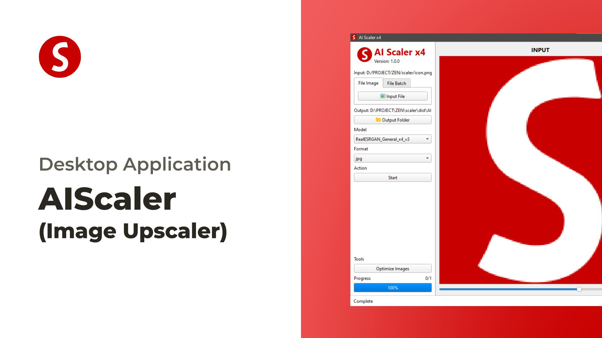

# AIScaler

<div align="center">



#### Free and Open Source AI Image Upscaler

AI Scaler make you enlarge and enhance low-resolution images using advanced AI algorithms.
Enlarge images without losing quality.

</div>

> [!IMPORTANT]
> You'll need a Vulkan compatible GPU to upscale images. Many CPU and iGPUs do not work but no harm in trying.

## Installation

### Windows (Windows 10 and later)

1. Go to [releases section](https://github.com/AIScaler/AIScaler/releases/latest)
2. Download the `AIScaler-vx.x.x-x86_64.exe` file.
3. Double click exe file, wait for installation.

### Linux

1. Go to [releases section](https://github.com/AIScaler/AIScaler/releases/latest)
2. Download the `.AppImage` file.
3. `chmod +x AIScaler-vx.x.x-x86_64.AppImage`
4. `./AIScaler-vx.x.x-x86_64.AppImage`

## Build

### Shared Build (MSYS2)

```sh
# Install Qt6 Lib
pacman -S mingw-w64-ucrt-x86_64-qt6-base

mkdir build && cd build
cmake -S . -B build/msys -G "Ninja" -DCMAKE_BUILD_TYPE="Debug" # for Debug
cmake -S . -B build/msys -G "Ninja" -DCMAKE_BUILD_TYPE="Release" # for Release
cmake --build build/msys --config Debug
cmake --build build/msys --config Release
```

### Static Build (MSVC)

```sh
# Download Qt6 Static from https://github.com/gmh5225/static-build-qt6/releases/tag/qt6_660_static

mkdir msvc && cd msvc
cmake -S . -B build/msvc -G "Visual Studio 17 2022" -DCMAKE_PREFIX_PATH="D:/Qt/6.7.2/msvc2019_64_static" -DCMAKE_INSTALL_PREFIX="install" -DCMAKE_CONFIGURATION_TYPES="Release"
cmake --build build/msvc --config Release
cmake --install build/msvc
```

## Credits

- Real-ESRGAN for their wonderful research work. [Real-ESRGAN: Copyright (c) 2021, Xintao Wang](https://github.com/xinntao/Real-ESRGAN/)

## License

Copyright 2023-2024 zeindevs. Licensed under the Apache License Version 2.0.
